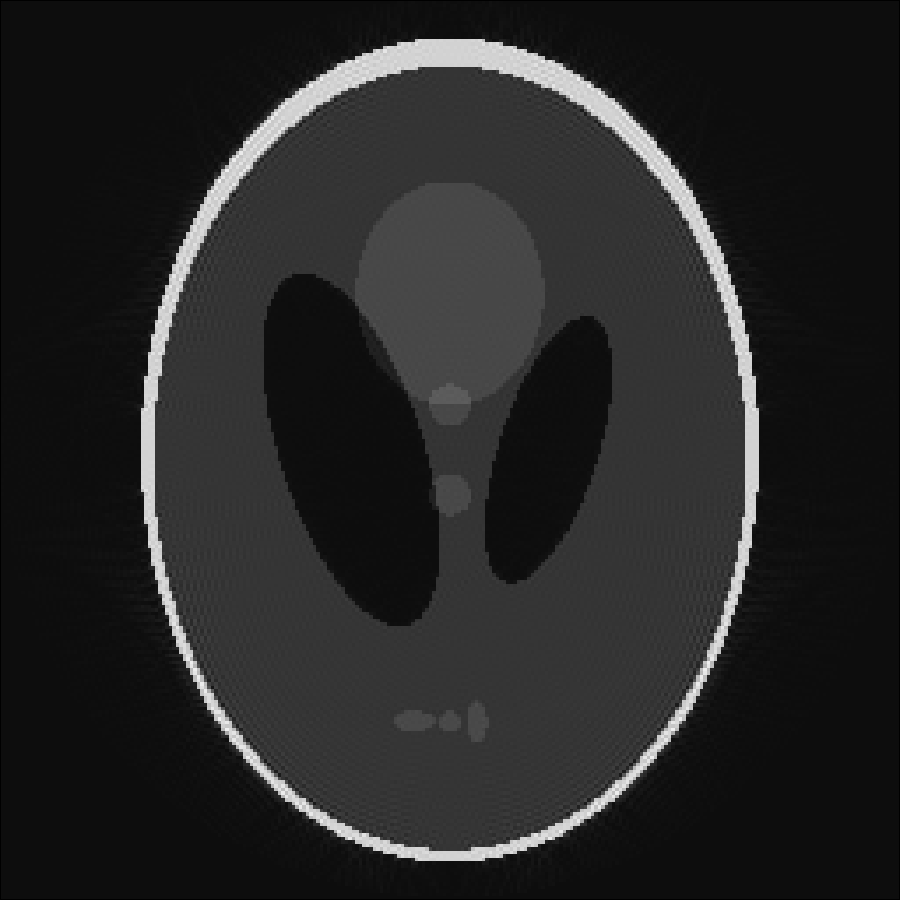

# Parallel Imaging

For parallel imaging MRIReco.jl uses an iterative SENSE approach. In the following
code example we show how to simulate MRI data with an array of 8 coils and how to
reconstruct that data using SENSE. The example can be run by entering
```julia
include(joinpath(dirname(pathof(MRIReco)),"../docs/src/examples/exampleSENSE.jl"))
```
into the Julia REPL.
```julia
N = 256
numCoils = 8
I = shepp_logan(N)
I = circularShutterFreq!(I,1)

coilsens = birdcageSensitivity(N, 8, 1.5)

# simulation parameters
params = Dict{Symbol, Any}()
params[:simulation] = "fast"
params[:trajName] = "Spiral"
params[:numProfiles] = 6
params[:numSamplingPerProfile] = div(N*N,16)
params[:windings] = div(N,16)
params[:AQ] = 2.0e-2
params[:senseMaps] = coilsens

# do simulation
acqData = simulation(I, params)

# reco parameters
params = Dict{Symbol, Any}()
params[:reco] = "multiCoil"
params[:reconSize] = (N,N)
params[:regularization] = "L2"
params[:λ] = 1.e-3
params[:iterations] = 40
params[:solver] = "cgnr"
params[:senseMaps] = coilsens

# do reconstruction
Ireco = reconstruction(acqData, params)

```
Below one can see the orignal phantom on the left and the reconstruction on the right:



