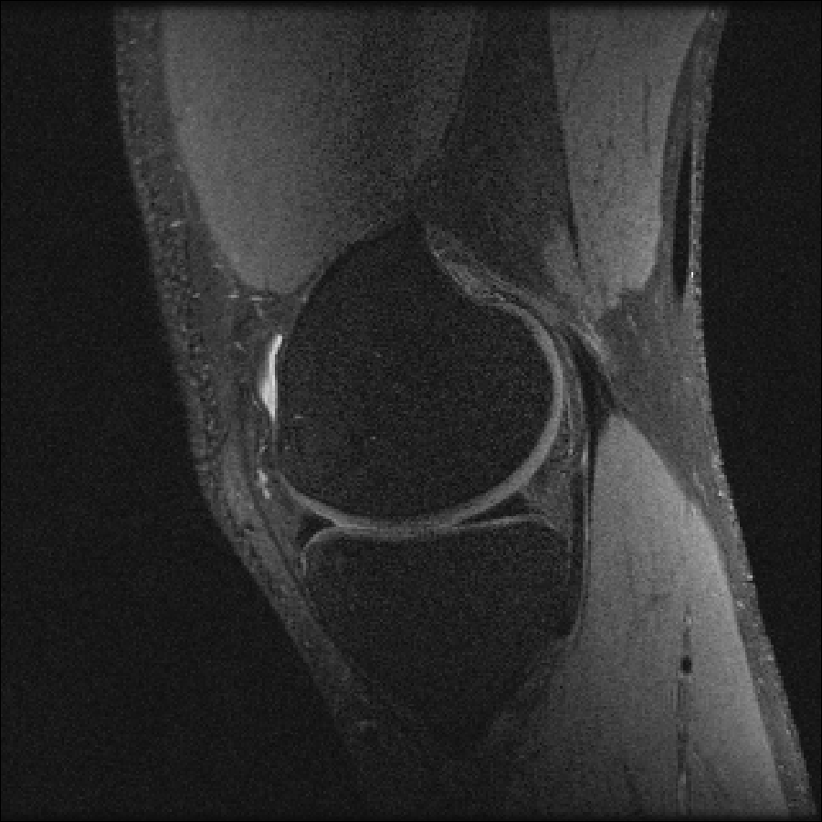
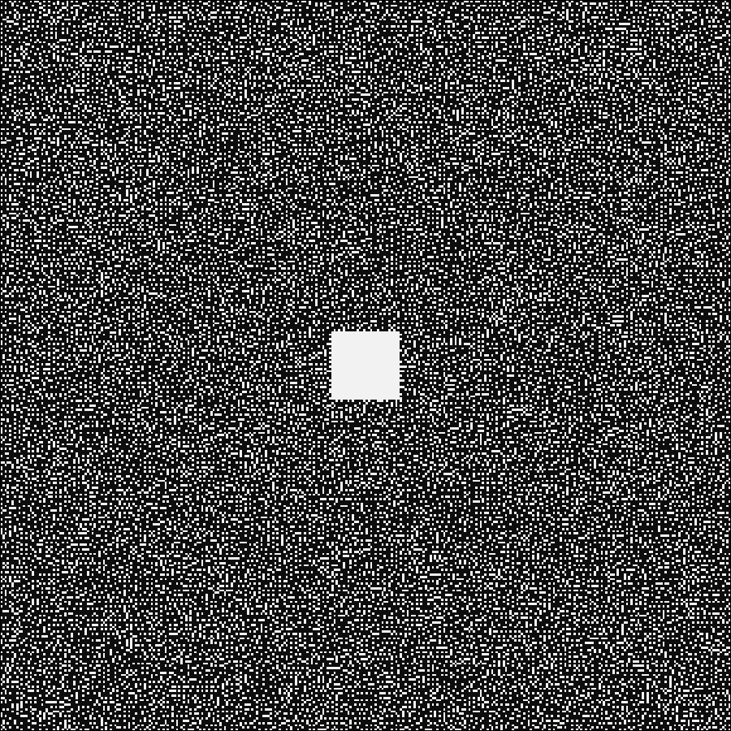
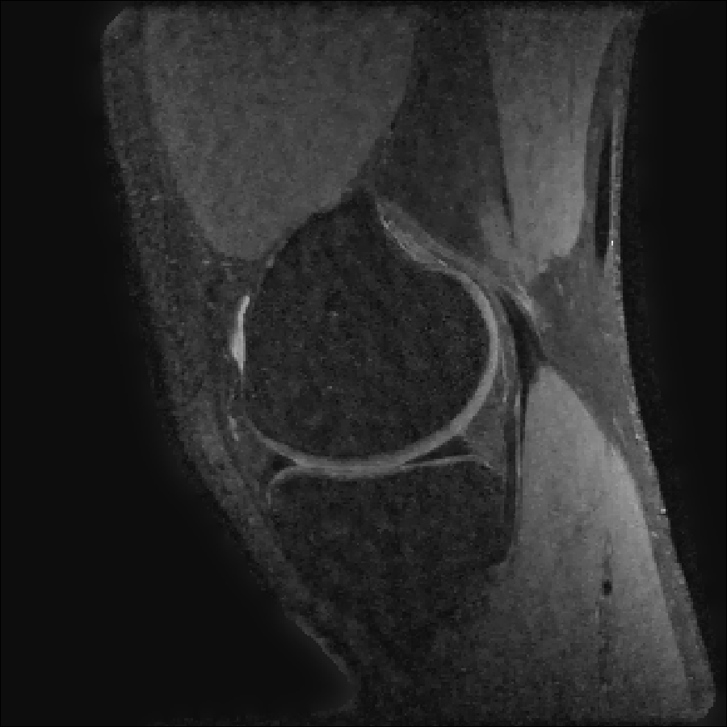

# Compressed Sensing

We next consider a compressed sensing reconstruction using one slice of a knee
dataset obtained from [mridata.org](http://mridata.org). The example
can be run by entering
```julia
include(joinpath(dirname(pathof(MRIReco)),"../docs/src/examples/exampleCS.jl"))
```
into the Julia REPL.

We first perform a baseline reconstruction with fully sampled data:
```julia
# load fully sampled data
f = ISMRMRDFile("data/knee_3dFSE_slice170.h5")
acqData = AcquisitionData(f);

# reconstruct
params = Dict{Symbol, Any}()
params[:reco] = "direct"
params[:reconSize] = (320,320) # this size is also contained in acqData.encodingSize

img = reconstruction(acqData, params)
img = sqrt.(sum(img.^2,dims=5))
```
The result looks like this:



To simulate an undersampled reconstruction, we retrospectively undersample the data using a Poisson disk pattern.

```julia
redFac = 4.0
acqDataSub = sample_kspace(acqData,redFac,"poisson",calsize=30,profiles=false);
```

The sampling pattern looks like this:



Then, we estimate the coil sensitivities using ESPIRiT

```julia
smaps = espirit(acqData,(6,6),30,eigThresh_1=0.035,eigThresh_2=0.98)
```

and perform a simple SENSE reconstruction. We expect a degradation in image quality due to the
subsampling:

```julia
params = Dict{Symbol, Any}()
params[:reco] = "multiCoil"
params[:reconSize] = (320,320)
params[:senseMaps] = smaps

params[:solver] = "cgnr"
params[:regularization] = "L2"
params[:λ] = 1.e-4
params[:iterations] = 5
params[:normalizeReg] = true

img_cg = reconstruction(acqDataSub, params)
```

Using TV regularization recquires us to change some parameters:

```julia
params = Dict{Symbol, Any}()
params[:reco] = "multiCoil"
params[:reconSize] = (320,320)
params[:senseMaps] = smaps

params[:solver] = "admm"
params[:regularization] = "TV"
params[:λ] = 1.e-1 # 5.e-2
params[:iterations] = 50
params[:ρ] = 0.1
params[:absTol] = 1.e-4
params[:relTol] = 1.e-2
params[:tolInner] = 1.e-2
params[:normalizeReg] = true

img_tv = reconstruction(acqDataSub, params)
```
Lets compare the results, left the regular SENSE reconstruction and right the
TV reglarized solution:



