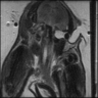

# File Handling

MRI [Acquisition Data](@ref) can not only be generated from simulation but also from files.
Currently, MRIReco supports the ISMRMRD file format the Bruker file format (at least partially).

The ISMRMRD is fully supported with proper read and write support. For the Bruker file format
only reading of data is supported.

The example discussed in the following can be run by entering
```julia
include(joinpath(dirname(pathof(MRIReco)),"../docs/src/examples/exampleIO.jl"))
```
into the Julia REPL.

We start by loading a file handle to a Bruker dataset using
```julia
f = BrukerFile("brukerfileCart")
```
This file handle does not yet contain the data. To load the data we call
```julia
raw = RawAcquisitionData(f)
```
which will load all data that can be encoded into a `RawAcquisitionData` object.
For reconstruction we can then convert it to the preprocessed data format and call
```julia
acq = AcquisitionData(raw)

params = Dict{Symbol, Any}()
params[:reco] = "direct"
params[:reconSize] = (acq.encodingSize[1],acq.encodingSize[2])

img = reconstruction(acq, params)
```
This will result in the following image:



## Saving

But loading the data is only one important operation. Lets suppose that you have
performed an expensive simulation resulting in a raw data object `raw`. To store
this data one can simply run
```julia
fout = ISMRMRDFile("outputfile.h5")
save(fout, raw)
```
which will generate an ISMRMRD file containing the data.

## Conversion

It should now be no surprise that MRIReco.jl does also allow for file conversion:
```julia
f = BrukerFile("brukerfileCart")
raw = RawAcquisitionData(f)
fout = ISMRMRDFile("outputfile.h5")
save(fout, raw)
```
Currently, this is only limited to converting Bruker files into ISMRMRD files but
the infrastructure is not limited to that.
