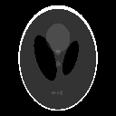

# Getting Started

Throughout the entire documentation we assume that you have loaded `MRIReco`
as well as `PyPlot` via
```julia
using PyPlot, MRIReco
```
Its important to load these packages in that order, since otherwise `PyPlot`
will not work correctly on some systems.

All examples discussed in the documentation can be found in the package source
code in the folder
```
    MRIReco/docs/src/examples
```
This folder is located in `~/.julia/packages` or `~/.julia/dev` depending if you
have checked out `MRIReco` for development or not. You can call the first example
by entering into the Julia REPL:
```julia
include(joinpath(dirname(pathof(MRIReco)),"../docs/src/examples/exampleRadial.jl"))
```
which should open a plotting window as is outlined in the following example.

## Basic Example

We will start with a very simple example and perform simple simulation and
reconstruction based on a shepp logan phantom. The program looks like this
```julia
# image
N = 256
I = shepp_logan(N)

# simulation parameters
params = Dict{Symbol, Any}()
params[:simulation] = "fast"
params[:trajName] = "Radial"
params[:numProfiles] = floor(Int64, pi/2*N)
params[:numSamplingPerProfile] = 2*N

# do simulation
acqData = simulation(I, params)

# reco parameters
params = Dict{Symbol, Any}()
params[:reco] = "direct"
params[:reconSize] = (N,N)
Ireco = reconstruction(acqData, params)
```
We will go through the program step by step. First we create a 2D shepp logan
phantom of size `N=256`. Then we setup a dictionary that defines the simulation
parameters. Here, we chose a simple radial trajectory with 402 spokes and 512
samples per profile. We use a gridding-based simulator by setting `params[:simulation] = "fast"`

After setting up the parameter dictionary `params`, the simulation is performed
by calling
```julia
acqData = simulation(I, params)
```
The result `simulation` function outputs an acquisition object that is discussed
in more detail in the section [Acquisition Data](@ref).
The acquisition data can also be stored to or loaded from a file, which will be discussed
in section [File Handling](@ref).

Using the acquisition data we can perform a reconstruction. To this end,
again a parameter dictionary is setup and some basic configuration is done.
In this case, for instance we specify that we want to apply a simple NFFT-based
gridding reconstruction. The reconstruction is invoked by calling
```julia
Ireco = reconstruction(acqData, params)
```
The resulting image is of type `AxisArray` and has 5 dimensions. One can
display the image object by calling
```julia
imshow(abs.(Ireco[:,:,1,1,1]))
```
Alternatively one can store the image into a file, which will be discussed in
the section on [Images](@ref).

The original phantom and the reconstructed image are shown below




We will discuss reconstruction in more detail in the [Reconstruction](@ref) section.
Simulation will be discussed in more detail in the [Simulation](@ref) section.
