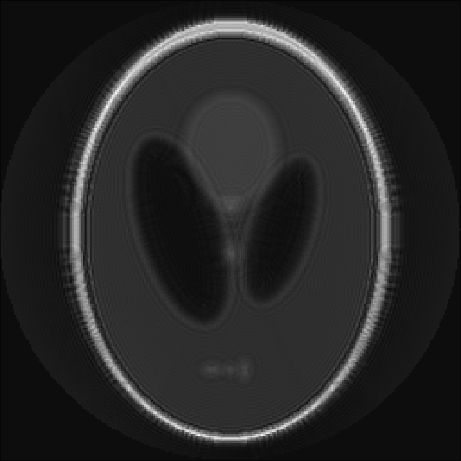

# Offresonance Correction

For trajectories with long readouts the MRI images are degraded by offresonance
artifacts, if the offresonance is not taken into account during reconstruction.
We provide fast algorithms that are capable of correcting offresonance
artifacts provided that the offresonance map is known. Our framework is also capable
of correcting T2* relaxation effects. The later are encoded in the real part of the
correction map while the offresoanance is encoded in the imaginary part. The
following example shows an example of a simulation and reconstruction of MRI data
that takes offresonance due to an inhomogeneous fieldmap into account. The example
can be run by entering
```julia
include(joinpath(dirname(pathof(MRIReco)),"../docs/src/examples/exampleFieldmap.jl"))
```
into the Julia REPL.
```julia
using MRIReco

N = 256
I = shepp_logan(N)
I = circularShutterFreq!(I,1)
cmap = 1im*quadraticFieldmap(N,N,125*2pi)

# simulation parameters
params = Dict{Symbol, Any}()
params[:simulation] = "fast"
params[:trajName] = "Spiral"
params[:numProfiles] = 1
params[:numSamplingPerProfile] = N*N
params[:windings] = 128
params[:AQ] = 3.0e-2
params[:correctionMap] = cmap[:,:,1]

# do simulation
acqData = simulation(I, params)

# reco parameters
params = Dict{Symbol, Any}()
params[:reco] = "direct"
params[:reconSize] = (N,N)
params[:correctionMap] = cmap
params[:alpha] = 1.75
params[:m] = 4.0
params[:K] = 28

# do reconstruction
Ireco = reconstruction(acqData, params)
```
The considered quadratic fieldmap looks like this:


The reconstruction without and with offresonance correction are shown below:



