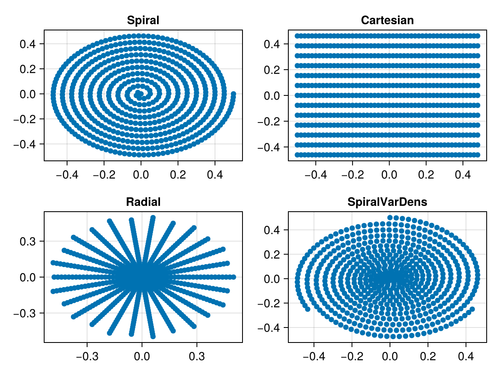

# Trajectory

Several typical MRI k-space trajectories are available:
* Cartesian
* EPI
* Radial
* Spiral
In addition, there is a `CustomTrajectory` type for implementing arbitrary k-space
trajectories. Currently, most of the trajectories are only available in 2D. Each trajectory
is of type `AbstractTrajectory` and implements the following functions
```julia
string(tr::AbstractTrajectory)
kspaceNodes(tr::AbstractTrajectory)
readoutTimes(tr::AbstractTrajectory)
```
For instance we can define a spiral trajectory using ...


```julia
...
```


